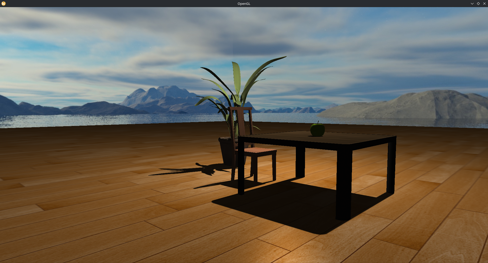

# Spatial Audio Demo

A real-time 3D engine prototype built with OpenGL, OpenAL and Assimp. Supports spatial audio, shadow mapping and state management.

### Features:
* Shadow mapping and dynamic lighting (as of now only 1 light source)
* Skybox rendering
* Spatial audio with OpenAL and HRTF support
* Modular engine architecture
* Object management (fame objects, audio sources, etc.) including auto-cleanup

## Details

Demonstrates OpenAL spatial audio with two audio sources:

* Mono WAV (Crab Rave by Noisestorm) positioned near the table
* Relative source for ambient sound

Light orbits around the center to showcase shadows and Blinn-Phong shader.

## Screenshots

## Dependencies

* GLAD
* GLFW
* Assimp
* stb_image
* OpenAL
* GLM
* libsndfile